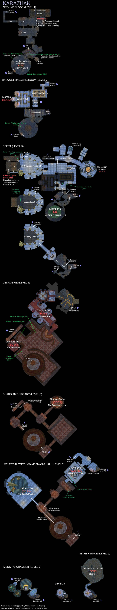

# WOW TBC taktiky bossů

## Instance
- [Karazhan (10)](kz.md)
- [Zul'Aman (10)](za.md)
- [Gruul's Lair (25)](gl.md)
- [Magtheridon's Lair (25)](ml.md)
- [Serpentshrine Cavern (25)](ssc.md)
- [The Eye - Tempest Keep (25)](tk.md)
- [Battle for Mount Hyjal (25)](mh.md)
- [The Black Temple (25)](bt.md)
- [Sunwell Plateau (25)](swp.md)

# Karazhan
- 10 lidí
- celkem padá 24 BoJ nechodí se Netherspite (-2) a případně Nightbane (-2)

## Attument the Huntsman
- 1 BoJ, epic mount
- potřeba dva tanci nebo jeden dobře oblečený protadin
- boj má 3 fáze
- na bosse nejde použít Taunt, je tedy důležité nepřebrat aggro

### 1. fáze
Uprostřed místnosti stojí samotný kůň, po pullu a nabrání threatu tankem se může začít útočit. Fáze končí, až má kůň 95% HP.
### 2. fáze
Na 95% života se objeví jezdec - toho musí nabrat druhý tank, damage pokračuje do koně. Pokud je v raidu hunter, může použít Misdirection a nastřelit jezdce na druhého tanka. Je lepší, když jezdce tankuje warrior - může mu dát Disarm. Jezdec dává před sebe Shadow Cleave, takže jej tank musí otočit směrem od raidu. Každých 30 vteřin castí AoE debuff Intangible Presence, který snižuje šanci na hit o 50% - je nutné dispellovat z tanků, dispell může mage nebo druid, případně warrior může použít Spell Reflection a debuff poté dostane boss :). Druhá fáze končí na 25% HP koně nebo jezdce.
### 3. fáze
Po dosažení 25% HP nasedne jezdec na koně, zároveň dojde k resetu threatu - je tedy nutné zastavit damage a počkat na opětovné nabrání. Všichni se přesunou za zadek koně - kdo bude stát více než 8 yardů od bosse může dostat Berserker Charge - vyletí do vzduchu a dostane velký damage.

## Moroes
- 2 BoJ, enchant recept Mongoose
- potřeba dva tanci nebo jeden dobře oblečený protadin, priest
- 5 NPC

## Maiden of Virtue
- 2 BoJ

## Opera Event
- 2 BoJ
- jsou tři možné varianty bossů

### 1. Red Riding Hood
Postačí jeden tank, boss dává plošný fear, dobře poslouží Tremor Totem od shamana. Občas někoho (non-melee) promění v červenou karkulku, hodí na něj debuff Little Red Riding Hood, a začne honit. Hráč musí utíkat dokola celého jeviště, po skončení debuffu se boss vrátí na tanka. Některé classy se tomu mohou vyhnout - rogue s Vanish, hunter s Feign Dead, případně může paladin na červenou karkulku hodit Blessing of Protection.

### 2. Wizzard of Oz
- boj má dvě fáze

#### 1. fáze
Spawnou se čtyři mobky - Dorothee (ještě vyvolá mobku Tito), Roar, Strawman a Tinhead. Jediný boss, kterého je nutné tankovat je Tinhead - toho si nabere MT. Dorothee musí být co nejrychleji zabita - svůj target si vybírá náhodně, Tito se může nechat na pokoji. Roar do fearu a zabít naposled. Strawman - toho tankuje někdo s fire spelly - mage, warlock nebo shaman - pouze postačí spamovat fire spelly.

#### 2. fáze
Po zabití všech mobek s první fáze se vyvolá boss The Crone. Pouze ho nabere MT.

### 3. Romulo and Julianne

## The Curator
- 2 BoJ, T4 hands token

## Terestian Illhoof
- 2 BoJ, enchant recept Soulfrost

## Shade of Aran
- 2 BoJ, enchant recept Sunfire

## Netherspite
- 2 BoJ

## Chess Event
- 2 BoJ

## Prince Malchezaar
- 5 BoJ, T4 head token

## Nightbane
- 2 BoJ

# Mapa

